# Current Spring Bean-Based Agent Architecture

## How It Works: End-to-End Flow

```mermaid
flowchart TD
    %% User Layer
    User[👤 User] --> Upload[📤 Upload PRD]
    Upload --> Angular[🎨 Angular Frontend]
    
    %% API Layer
    Angular --> API[🔗 REST API Controller]
    API --> PRDService[⚙️ PRD Processing Service]
    
    %% Analysis Phase
    PRDService --> AIAnalysis[🤖 AI Analysis]
    AIAnalysis --> Blueprint[📋 Project Blueprint]
    
    %% Agent Orchestration
    Blueprint --> Orchestrator[🎭 Agent Orchestrator]
    
    %% Agent Execution (Parallel)
    Orchestrator --> Agents[⚡ Spring Bean Agents<br/>Execute in Parallel]
    
    subgraph AgentTypes[Agent Types]
        Frontend[🎨 Frontend Agent]
        Backend[⚙️ Backend Agent] 
        Database[🗄️ Database Agent]
        DevOps[🚀 DevOps Agent]
        QA[🧪 QA Agent]
        Integration[🔗 Integration Agent]
    end
    
    Agents --> AgentTypes
    
    %% Results Collection
    AgentTypes --> Results[📊 Collect Results]
    Results --> ZipGen[📦 Generate ZIP Files]
    
    %% Final Output
    ZipGen --> BackendZip[📦 Backend.zip]
    ZipGen --> FrontendZip[📦 Frontend.zip]
    BackendZip --> Download[📥 Download API]
    FrontendZip --> Download
    Download --> User
    
    %% Styling
    classDef ui fill:#e1f5fe,stroke:#01579b,stroke-width:2px
    classDef backend fill:#f3e5f5,stroke:#4a148c,stroke-width:2px
    classDef ai fill:#fff3e0,stroke:#e65100,stroke-width:2px
    classDef agent fill:#e8f5e8,stroke:#1b5e20,stroke-width:2px
    
    class User,Angular,Download ui
    class API,PRDService,Orchestrator,ZipGen backend
    class AIAnalysis,Blueprint ai
    class Agents,AgentTypes,Frontend,Backend,Database,DevOps,QA,Integration,Results agent
```



## Key Architecture Components

### 1. **Spring Bean Agents**
Each agent is a `@Component` that implements the `ProjectAgent` interface:

```java
@Component
public class FrontendCodeAgent implements ProjectAgent {
    private final ChatClient chatClient;
    
    @Override
    public boolean canProcess(ProjectBlueprint blueprint) {
        // Logic to determine if this agent should run
    }
    
    @Override
    public CompletableFuture<AgentResult> processAsync(ProjectBlueprint blueprint) {
        // Generate code using AI
    }
}
```

### 2. **Agent Orchestrator**
The orchestrator manages agent execution:

```java
@Service
public class AgentOrchestrator {
    public List<AgentResult> orchestrateProject(ProjectBlueprint blueprint) {
        // 1. Filter applicable agents based on blueprint
        // 2. Execute agents in parallel using CompletableFuture
        // 3. Collect and return all results
    }
}
```

### 3. **Data Flow**


## Advantages of Current Approach

### ✅ **Predictable Execution**
- Fixed agent execution order based on priority
- Deterministic behavior for testing and debugging
- Clear separation of concerns

### ✅ **Performance**
- Parallel agent execution using `CompletableFuture`
- No additional LLM calls for orchestration decisions
- Efficient resource utilization

### ✅ **Maintainability**
- Each agent is a separate, testable class
- Spring dependency injection handles configuration
- Easy to add/remove/modify agents

### ✅ **Error Handling**
- Individual agent failures don't stop other agents
- Detailed error reporting per agent
- Graceful degradation

## Implementation Details

### Agent Interface
```java
public interface ProjectAgent {
    String getAgentName();
    String getDescription();
    int getPriority();
    boolean canProcess(ProjectBlueprint blueprint);
    CompletableFuture<AgentResult> processAsync(ProjectBlueprint blueprint);
}
```

### Agent Execution Flow
1. **Filter Phase**: Orchestrator filters agents based on `canProcess()`
2. **Parallel Phase**: Applicable agents run simultaneously
3. **Collection Phase**: Results aggregated into `OrchestrationResult`
4. **Generation Phase**: Results converted to ZIP files

### Configuration
- **Spring AI**: Auto-configured `ChatClient` bean
- **OpenAI**: GPT-4 model with temperature 0.3
- **Parallel Execution**: Fixed thread pool of 4 threads
- **Timeout**: 10-minute timeout per agent

This approach provides a solid, predictable foundation for AI-driven code generation while maintaining the flexibility to enhance with more AI-driven orchestration in the future.
